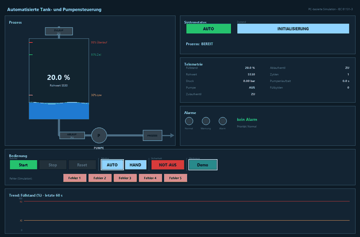
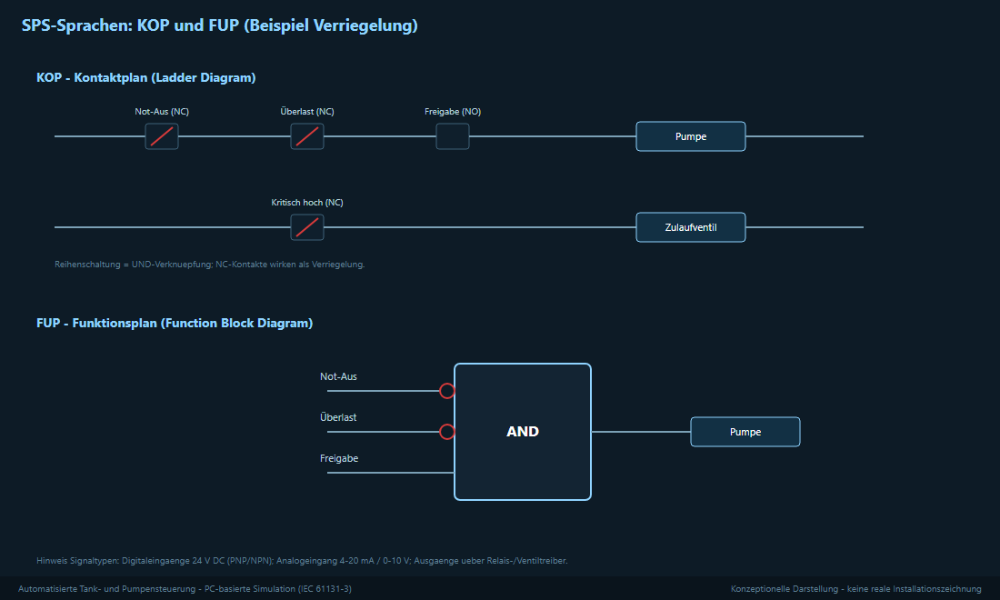

# Automatisierte Tank- und Pumpensteuerung mit SPS

Eine kleine Anlage: Ein Tank wird automatisch gefüllt und abgepumpt. Die
Steuerung überwacht den Füllstand, schaltet **Magnetventile** und das
**Pumpenschütz** und sorgt mit **Verriegelungen** für einen sicheren Ablauf.

## Die Anlage

- **Tank** mit Zulauf und Ablauf
- **Zulaufventil** und **Ablaufventil** (Magnetventile)
- **Pumpe**, angesteuert über ein **Pumpenschütz** und abgesichert durch einen
  **Motorschutzschalter**
- **Grenzwertgeber / Schwimmschalter** (fast leer, fast voll, zu voll)
- **Füllstandsmessung** als Analogsignal
- **Meldeleuchten** (grün/gelb/rot) und **Hupe**

Mehr dazu: [Systembeschreibung](unterlagen/01_Systembeschreibung.md)

## Signale und Feldgeräte

Die Anlage nutzt typische Industriesignale:

- **Digitale Eingänge 24 V DC** für Taster, Wahlschalter, Grenzwertgeber,
  Motorschutz und Rückmeldungen
- **Analoger Eingang 4–20 mA** für den Füllstand
- **Digitale Ausgänge** über Relais/Ventiltreiber für Ventile, Pumpenschütz und
  Melder

Alle Signale: [E/A-Liste](unterlagen/02_EA_Liste.md)

## Steuerungsablauf

Der Ablauf ist eine **Ablaufsteuerung** in klaren Schritten:
**BEREIT → FÜLLEN → PROZESSBEREIT → PUMPEN → STOPPEN**. Damit das Zulaufventil
nicht ständig schaltet, arbeitet der Füllstand mit einer **Hysterese**
(Füllen von 30 % bis 80 %).

Details: [Steuerungsablauf](unterlagen/05_Steuerungsablauf.md)

## Sicherheit und Verriegelungen

- **Trockenlaufschutz** – die Pumpe läuft nur bei genug Wasser.
- **Überfüllschutz** – bei zu vollem Tank wird der Zulauf gesperrt.
- **Überlastschutz** – der Motorschutz stoppt die Pumpe.
- **Gegenseitige Verriegelung** – Zulauf und Ablauf sind nie gleichzeitig offen.
- **Not-Aus** – in einer realen Anlage schaltet ein **Sicherheitsschaltgerät**
  (z. B. PNOZ) die Antriebe **allpolig** ab.

Details: [Sicherheit und Verriegelungen](unterlagen/03_Sicherheit_Verriegelungen.md)

## Störungen und Meldungen

Jede Störung hat eine **Nummer** und wird **gespeichert**: Die rote Lampe und
die Hupe bleiben an, bis die Ursache behoben und **Reset** gedrückt wurde.
Beispiele: Pumpenüberlast (A003), Sensorfehler (A006), kritischer Füllstand
(A005).

Details: [Störungen und Meldungen](unterlagen/04_Stoerungen_Meldungen.md)

## Bedienung (HMI)

Eine Bedienoberfläche zeigt den Prozess: Tank mit Füllstand, Ventile, Pumpe,
Meldeleuchten und einen Verlauf des Füllstands. Über Tasten gibt es Start,
Stop, Reset, AUTO/HAND und Not-Aus.

---

**Unterlagen:** [Systembeschreibung](unterlagen/01_Systembeschreibung.md) ·
[E/A-Liste](unterlagen/02_EA_Liste.md) ·
[Sicherheit und Verriegelungen](unterlagen/03_Sicherheit_Verriegelungen.md) ·
[Störungen und Meldungen](unterlagen/04_Stoerungen_Meldungen.md) ·
[Steuerungsablauf](unterlagen/05_Steuerungsablauf.md)

Lizenz: MIT
