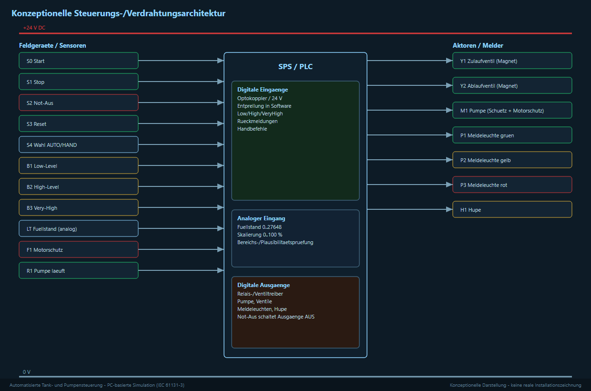

# 02 – E/A-Liste (Signale)

Hier stehen alle Signale der Anlage. Die Spalte *Adresse* ist die übliche
SPS-Adressierung (`%IX`, `%QX`, `%IW`).

## Digitale Eingänge (24 V DC)

| Adresse | Signal | Bedeutung |
|---------|--------|-----------|
| %IX0.0 | Start | Taster Start |
| %IX0.1 | Stop | Taster Stop |
| %IX0.2 | Not-Aus | Not-Aus aktiv |
| %IX0.3 | Reset | Taster Reset / Quittierung |
| %IX0.4 | AUTO/HAND | Wahlschalter Betriebsart |
| %IX0.5 | Low | Grenzwertgeber fast leer |
| %IX0.6 | High | Grenzwertgeber fast voll |
| %IX0.7 | Very-High | Grenzwertgeber zu voll |
| %IX1.0 | Motorschutz | Überlast der Pumpe |
| %IX1.1 | Pumpe läuft | Rückmeldung Pumpe |
| %IX1.2 | Ventil offen | Rückmeldung Zulaufventil |
| %IX1.3 | Ventil zu | Rückmeldung Zulaufventil |

## Analoger Eingang

| Adresse | Signal | Bereich |
|---------|--------|---------|
| %IW64 | Füllstand | 4–20 mA, im Programm 0 … 100 % |

## Digitale Ausgänge (Relais / Ventiltreiber)

| Adresse | Signal | Bedeutung |
|---------|--------|-----------|
| %QX0.0 | Zulaufventil | Magnetventil Zulauf |
| %QX0.1 | Pumpe | Ansteuerung Pumpenschütz |
| %QX0.2 | Ablaufventil | Magnetventil Ablauf |
| %QX0.3 | Lampe grün | Betrieb |
| %QX0.4 | Lampe gelb | Warnung |
| %QX0.5 | Lampe rot | Störung |
| %QX0.6 | Hupe | Störung hörbar |
