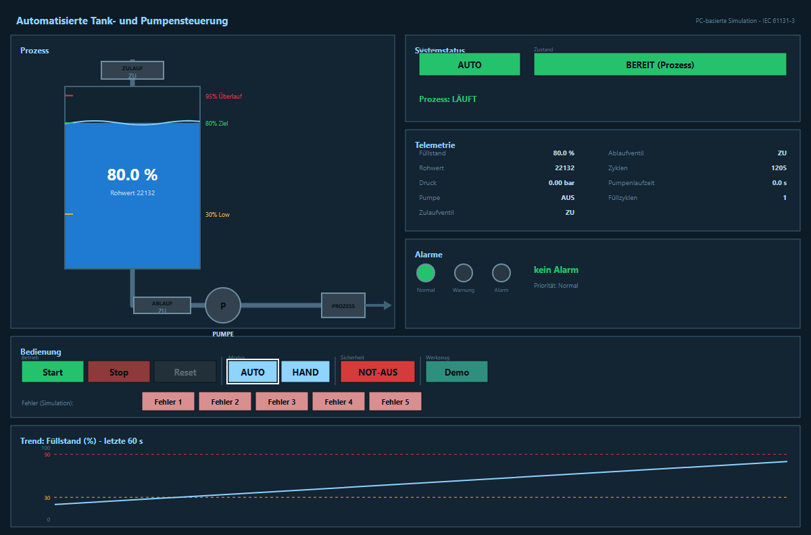

# 04 – Störungen und Meldungen

Jede Störung hat eine **Nummer** und wird gespeichert. Sie bleibt sichtbar, bis
die Ursache behoben und der **Reset** gedrückt wurde (Quittierung).

## Meldungen

| Nummer | Meldung | Reaktion |
|--------|---------|----------|
| A001 | Not-Aus | alle Ausgänge aus, sicherer Zustand |
| A002 | Pumpe – Rückmeldung fehlt | Pumpe aus |
| A003 | Pumpe – Überlast / Übertemperatur | Pumpe aus |
| A004 | Füllstand High | Warnung |
| A005 | Füllstand kritisch | Zulauf gesperrt |
| A006 | Sensorfehler | Anlage in sicheren Zustand |
| A007 | Ventil – Rückmeldung fehlt | Zulauf gesperrt |
| A008 | Befehlskonflikt | widersprüchliche Befehle gesperrt |
| A009 | Allgemeiner Fehler | Anlage in sicheren Zustand |

## Anzeige

- **Grün:** Betrieb, alles in Ordnung.
- **Gelb:** Warnung.
- **Rot:** Störung – zusätzlich ertönt die **Hupe**.

Bei einer Störung stoppt die Anlage sicher. Nach dem Beheben der Ursache wird
mit **Reset** quittiert.
