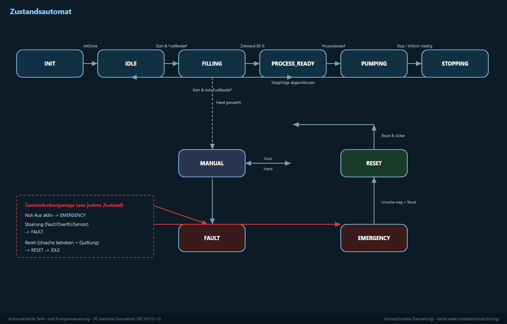

# 05 – Steuerungsablauf

Der Ablauf ist als **Ablaufsteuerung** (Zustandsautomat, GRAFCET-Denkweise)
aufgebaut: Die Anlage ist immer in genau einem Zustand, und Bedingungen
entscheiden, wann es weitergeht.

## Der Ablauf in Schritten

1. **BEREIT** – die Anlage wartet auf Start, alle Ausgänge sind aus.
2. **FÜLLEN** – das Zulaufventil öffnet, der Füllstand steigt.
3. **PROZESSBEREIT** – bei 80 % schließt das Zulaufventil.
4. **PUMPEN** – bei Bedarf fördert die Pumpe, der Füllstand sinkt.
5. **STOPPEN** – bei zu niedrigem Füllstand wird sicher gestoppt, dann wieder
   **BEREIT**.

Überlagert gibt es die Zustände **STÖRUNG** und **NOT-AUS**. Aus diesen geht es
erst nach Behebung der Ursache und **Reset** wieder weiter.

## Hysterese

Damit das Zulaufventil nicht ständig auf und zu geht, arbeitet der Füllstand
mit einer **Hysterese**:

- Füllen beginnt bei **30 %**.
- Füllen endet bei **80 %**.

Dazwischen bleibt der Zustand erhalten.

## Füllstand messen

Der Füllstand kommt als **analoges Signal (4–20 mA)** von der Messung und wird
im Programm auf **0 … 100 %** umgerechnet. Zusätzlich überwachen
**Grenzwertgeber** die wichtigen Punkte (fast leer, fast voll, zu voll).
